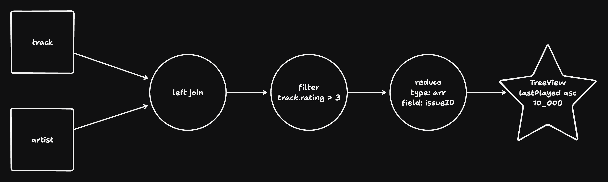
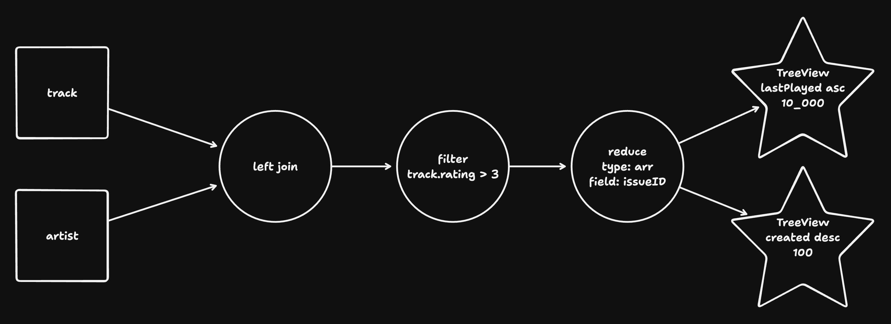

# IVM

The `ivm` directory implements incremental view maintenance for ZQL queries.

> 🤔 Note: In this context “view” means what it does in databases - an
> automatically updated query result - not what it does in UI.

# Background Reading

The IVM system was inspired by [DBSP: Automatic Incremental View Maintenance for
Rich Query Languages](https://www.vldb.org/pvldb/vol16/p1601-budiu.pdf), and
takes many ideas from it, but diverges in other places. This document
re-explains it from the ground up, without all the math, but if you're computer
science inclined you may also be interested in the paper.

# How it Works

Users build a “pipeline” which represents some ZQL query. The pipeline is a
Directed Acyclic Graph.

For example, the ZQL:

```ts
z.query.track
  .leftJoin(z.query.artist, 'artists', 'track.artistId', 'id')
  .groupBy('track.id')
  .select('track.*', 'artist.*', agg.array('artists.*', 'artists'))
  .orderBy('track.rating', 'desc')
  .limit(10_000)
  .prepare();
```

Might be represented by the following pipeline:

<figure>
  
  <figcaption>□ Source&nbsp;&nbsp;&nbsp;○ Operator&nbsp;&nbsp;&nbsp;☆ View&nbsp;&nbsp;&nbsp;→ DifferenceStream</figcaption>
</figure>

Each Node in the DAG is a [`Source`](./source/source.ts), an
[`Operator`](./graph/operators/operator.ts), or a [View](./view/view.ts). Each
edge is a [DifferenceStream](./graph/difference-stream.ts).

Changes originate in the pipeline at a `Source`. Sources represent something
like a database table – a set of items of some datatype. A `Source` can just be
an in-memory datastructure, like [`SetSource`](./source/set-source.ts), or it
can be an adapter to a full database.

Changes flow from Sources through `DifferenceStream`s to the various `Operator`s
of the pipeline, getting transformed, and are finally emitted at one or more
`View`s.

In Zero, the pipelines are typically built by
[`PipelineBuilder`](../ast-to-ivm/pipeline-builder.ts) to service some ZQL
query, but they can be build manually using just the code in this directory.

# Query Phases

There are three distinct _phases_ in a query's lifecycle. Each phase uses the
pipeline DAG to calculate an answer, but the algorithms are different. The
phases are:

1. **Hydration:** When the pipeline is first constructed and returns intial
   results.
2. **Update:** When something changes in a Source, and an update flows through
   the nodes of the pipeline, incrementally updating one or more Views.
3. **Pull:** Nodes in the pipeline sometimes require historical data from
   sources that has already been sent through the pipeline. For example, when a
   second view is attached to an existing pipeline, the new view needs _pull_
   old data to get itself up to date.

# Hydration

Pipeline components are stateful. For example the `reduce` operator keeps state
about the current reduction, `join` keeps state about entries it has already
seen so that it can find matches, and `Views` keep the current computed view.

When a pipeline is first constructed, each component's state needs to be
_hydrated_ so that when it later receives an update, the result can be computed
properly.

An easy way to hydrate operator state would be to feed the entire contents of
the database through the pipeline. We could send each row as an "update", and
then we'd not need a separate hydration phase. This is what the DBSP paper does.

This would be inefficient though: query results can be a tiny subset of the
database – often just a single row. We don't want to have to pump the entire DB
through the pipeline to get a tiny subset of data.

Instead, what we do is use the pipeline DAG to construct a _Pull Message_ which
contains more specific information about what data the pipeline actually needs.
The Source then uses this message to return a smaller subset of the data which
is closer to, or even exactly the data the pipeline needs.

## Pull Messages

Consider our tracks/artists example query above. When the view is first attached
to the pipeline, we need to hydrate the pipeline to initialize the state of all
the operators and give the view its first data.

To do this, the `View` sends a [`PullMsg`](./graph/message.ts) to its upstream
operator – in this case the `reduce` operator – asking for historical data. It
does this by calling `messageUpstream()` on its upstream `DifferenceStream`. The
`reduce` operator then does the same to its upstream (`filter`), and so-on. The
request propagates up through the DAG to the sources.

On the way upstream, each operator has the opportunity to add _conditions_ and
_sorts_ to the pull message being assembled to control the data the sources will
eventually return. In our query, the `TreeView` knows it wants the data sorted,
so it adds a `[[track.lastPlayed, asc]]` sort. And the `filter` adds a `filter:
track.rating > 3` condition.

The `left join` operator sends _two_ pull messages upstream – one for each side
of its join. To the track side it sends the sort and constraint it received from
downstream, and to the artist it sends no constraints.

## Pull Replies

Finally, the source receives the request and _replies_ with a stream of rows
that matches the request by calling its output stream's `newDifference()`
method. It is up to the source how it handles the request. For example
[`SetSource`](./source/set-source.ts) handles sort requests by lazily building
an in-memory sorted representation. However we also have a [SQLite
implementation](../../../../zqlite/src/table-source.ts) of `Source` that
delegates the sort and filter to SQLite.

Pull Replies are sent back through the pipeline as a
[`Multiset`](./multiset.ts), just like updates. But for hydration the Multiset
is really just a generic lazy iterator. The special features of a Multiset are
not used: every entry's `Multiplicity` is `1` and the order of entries is
important.

> 🤔 TODO: We should consider having a separate entry point on pipeline
> components for pull replies that has a different type so that readers don't
> have to keep in mind the different ways it is used.
>
> Alternately, we could have all calls to `newDifference()` use an ordered
> iterator like hydration does. In this case, the `Multiset` type should
> probably be renamed to `Update` or `ChangeList` or similar.

The `View` pulls on the Multiset iterator until it reaches its desired limit.
This pulls data through the pipeline, joining and filtering as necessary and
leaving the pipeline initialized and ready for the first update.

# Update

Once a pipeline is hydrated, it can then be used to process incremental
_updates_.

To do so, a source calls `newDifference()` on its downstream(s)
DifferenceStreams.

Updates are again passed down the graph as `Multiset`. But unlike during
hydration, for updates, the `Multiset` is actually used as a multiset.

To represent a row getting added, a `Multiplicity` of positive `1` is used. To
represent a row getting removed, `-1` is used. Any other integer can also be
used – it just represents more or fewer of the row getting added.

Also, during updates:

- The order of entries doesn't matter
- All entries must get processed – components can't stop processing early

This might seem confusing but it makes sense when you think about what's going
on. A pull reply is really something different than an incremental update. The
order matters during pull because pipeline components are trying to avoid
processing the entire stream.

In the case of an update, we expect the deltas to be small and processing the
entire thing makes more sense than sorting them first.

## Identity

It's important to understand that the pipeline doesn't inherently have any
notion of row identity. If a row `{id: "r1", v: 1}` got updated to `{id: "r2",
v: 2}`, we would see the following Multiset flow through the pipeline:

```
[[{id:"r1", v:1}, -1], [{id: "r1", v:2}, 1]]
```

There's no connection between the first entry and the second entry from the
Pipeline's point of view. The first one gets joined and creates a bunch of
remove entries, removing the old row and all its children, then the second one
gets joined and creates different add entries.

It is up to the views to dedupe entries by value when they receive it.

> TODO: `TreeView` currently dedupes by `id` but this is a bug since edits
> aren't guaranteed to come in the correct order.

# Pull

Pull happens when a component requires historical data. One way this can happen
is if a new view is added to an existing pipeline:

<figure>
  
  <figcaption>Second view added to existing pipeline</figcaption>
</figure>

Zero doesn't ever branch pipelines this way currently, so the pull phase doesn't
occur in Zero today.

But in the near future, when we run IVM on the server, we expect to start using
pull. This is because we won't be able to keep the entire state of the backend
db in memory in operators, so we will use pull to request historical state when
needed.

## Pull Requests

Just like with hydration, a `PullMsg` is sent up the tree accumulating sorts and
filters and the Source sends a reply back down.

Except in this case, the pipeline components have already been hydrated and need
to avoid rehydrating themselves. This isn't just a performance issue since in
cases like `sum()` re-hydrating will actually create the wrong answer.

# Transactions

`newDifference()` naturally represents changes from a single upstream
transaction. For example, we map changes from every Replicache transaction into
a single call to `newDifference()`.

But `ivm` also supports its own separate lightweight notion of _transactions_.
Calling `materialite.tx()` wraps the passed function in a Materialite
transaction. The function can call `newDifference()` multiple times and
listeners to output views are not notified until the transaction closes.

Pipeline operators hook into this notion of transactions to keep some
per-transaction state and make certain optimizations.

> 🤔 TODO: This could probably be removed by having callers who are currently
> using transactions accumulate a `Multiset` and call `newDifference()` instead
> of `tx()`.
